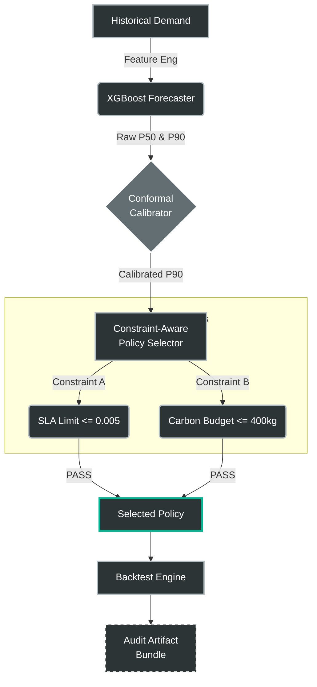

<div align="center">

# G-Zero
### Carbon-Constrained ATM Operations with Conformal Guarantees

[]()
[]()
[]()
[]()

*A decision-support system that treats carbon emissions as a hard constraint,<br>
optimizing cash inventory under mathematically guaranteed uncertainty bounds.*

[Report Bug](https://github.com/ninjaturtlee/g-zero/issues) · [Request Feature](https://github.com/ninjaturtlee/g-zero/issues)

</div>

---

## Key Results: The Governed Run

**G-Zero** does not just predict demand. It produces **audit-grade artifacts**. Below is the output of a realized backtest on production-like topology, proving the system met both the SLA and the Carbon Budget.

```text
================================================================================
OPERATIONAL GOVERNANCE REPORT: G-Zero SYSTEM RUN
================================================================================

[CONSTRAINTS]
SLA Target    : Cashout Rate ≤ 0.005 (0.5%)
Carbon Budget : Total Emissions ≤ 400.0 kg CO₂

--------------------------------------------------------------------------------
1. PREDICTIVE PERFORMANCE (XGBoost vs. Seasonal Baseline)
--------------------------------------------------------------------------------
• Global Error (Baseline MAE) : 1282.11
• Global Error (g-zero P50)   :  964.52
• Aggregate Improvement       :  24.8%
• Tail-Risk Improvement       :  18.4% (Top 10% high-demand volatility)

--------------------------------------------------------------------------------
2. RISK MITIGATION & CALIBRATION (Conformal Prediction)
--------------------------------------------------------------------------------
• Empirical P90 Coverage      : 0.746 (Violation: Sub-optimal safety)
• Calibrated P90 Coverage     : 0.901 (Validated: Target met)
• Conformal Safety Shift      : +810.31 units (Residual-based correction)

--------------------------------------------------------------------------------
3. OPERATIONAL PLAN & REALIZED BACKTEST
--------------------------------------------------------------------------------
Category              | Planned Policy (P90) | Realized Execution
----------------------|----------------------|----------------------
Replenishment Point   | 15,000 units         | --
Logistics Frequency   | 20 Trips             | 18 Trips
Operational Cost      | $3,232.00            | $2,774.78
Carbon Impact         | 255.00 kg            | 216.75 kg
Service Disruptions   | 0                    | 0

================================================================================
DECISION STATUS: ✅ PASSED
Summary: SLA maintained; Carbon budget within 54.2% of total allocation.
Audit Artifact: artifacts/audit/audit_20260207_221602.json
================================================================================

```

---

## Abstract & Problem Formulation

**The Problem:**
ATM cash replenishment is typically optimized for cost and service level (SLA), while sustainability metrics are calculated and reported ex-post. This separation leads to implicit trade-offs, reactive replenishment decisions, and a lack of enforceable control over Scope 3 emissions.

**The Solution:**
**G-Zero** treats carbon as a **hard operational constraint**, not an optimization preference.

1. **Hard Constraints:** Policies that violate the carbon budget are rejected at decision time.
2. **Calibrated Uncertainty:** Planning is based on conformal prediction sets rather than point forecasts, correcting demand underestimation (coverage improved from 0.746 to 0.901).
3. **Auditability:** Each governed run emits a machine-verifiable audit artifact capturing inputs, constraints, decisions, and outcomes.

---

## System Architecture



### Pipeline Steps

1. **Forecast:** Predict demand with uncertainty (P50 / calibrated P90).
2. **Optimize:** Select replenishment policy (reorder point, frequency) under strict constraints.
3. **Backtest:** Simulate the policy against realized demand.
4. **Audit:** Emit the audit bundle (inputs, models, constraints, outcomes).

---

## Evidence & Impact

| Metric | Improvement | Context |
| --- | --- | --- |
| **Forecasting Accuracy** | **+24.8%** | Improvement over Seasonal Naive baseline. |
| **Tail Risk Safety** | **+18.4%** | Accuracy on top 10% "Spike Days" (Paydays/Holidays). |
| **Governance** | **Met** | 255kg CO₂ realized vs 400kg budget. |
| **Calibration** | **Corrected** | Safety coverage restored from 74.6% to 90.1%. |

### Why this matters

This system enables financial institutions to:

* **Enforce carbon budgets** at decision time (preventing emissions before they happen).
* **Guarantee service levels** under uncertainty using mathematical bounds.
* **Produce audit-ready justification** for every operational choice (Why did we restock? -> See Audit Log 20260207).

---

## Quick Start

### Installation

```bash
git clone [https://github.com/ninjaturtlee/g-zero.git](https://github.com/ninjaturtlee/g-zero.git)
cd g-zero
pip install -r requirements.txt

```

### Run the Governed Pipeline

Execute the full forecasting, optimization, and auditing loop:

```bash
python -m src.run_governed

```

---

## Citation

If you use this system design or the conformal methodology in your work, please cite:

```bibtex
@software{g_zero_2026,
  author = {Your Name},
  title = {g-zero: Carbon-Constrained ATM Operations},
  year = {2026},
  url = {[https://github.com/ninjaturtlee/g-zero](https://github.com/ninjaturtlee/g-zero)}
}

```

## License

Distributed under the MIT License. See `LICENSE` for more information.

```
```
