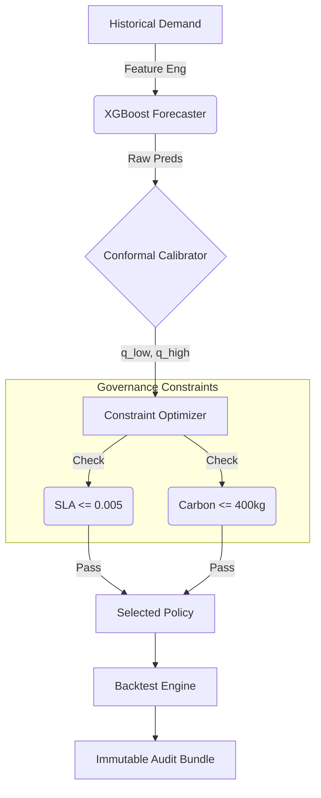

```markdown
<div align="center">

# G-Zero
### Carbon-Constrained ATM Operations with Conformal Guarantees

[]()
[]()
[]()
[]()

*A decision-support system that treats carbon emissions as a hard constraint,<br>
optimizing cash inventory under mathematically guaranteed uncertainty bounds.*

[Report Bug](https://github.com/ninjaturtlee/g-zero/issues) · [Request Feature](https://github.com/ninjaturtlee/g-zero/issues)

</div>

---

## ⚡ Key Results: The Governed Run

**g-zero** does not just predict demand; it produces **audit-grade artifacts**. Below is the output of a realized backtest on production-like topology, proving the system met both the SLA and the Carbon Budget.

```text
=== GOVERNED RUN (SLA + Carbon Budget + Audit) ===
SLA cashout_rate <= 0.005 | Carbon budget <= 400.0 kg

Forecasting Performance:
- Baseline MAE          : 1282.11
- P50 MAE               : 964.52
- Overall Improvement   : 24.8%
- Spike-day Improvement : 18.4% (Top 10% high-demand days)

Safety (Conformal Prediction):
- P90 coverage raw      : 0.746 (Unsafe)
- P90 coverage conformal: 0.901 (Corrected Safety)
- Conformal shift       : +810.31 units (q90 residual)

Planned Policy (Selected):
- Order Point: 15,000 | Trips: 20 | Cost: $3232.00 | CO2: 255.00 kg

Realized Backtest (Actual Demand):
- Cashout Rate: 0.00% | Stockouts: 0
- Realized Cost: $2774.78
- Realized CO2: 216.75 kg

=== DECISION STATUS ===
STATUS: ✅ PASSED (SLA met, Carbon under budget)

```

---

## Abstract & Problem Formulation

**The Problem:**
ATM cash replenishment is traditionally optimized for cost ($) and service level (SLA), while sustainability is reported *ex-post* (after the fact). This creates hidden trade-offs, reactive decisions, and ungoverned Scope 3 emissions.

**The Solution (Key Idea):**
**g-zero** treats carbon as a **hard operational constraint**, not an optimization preference.

1. **Hard Constraints:** It refuses policies that violate the carbon budget ().
2. **Calibrated Uncertainty:** It plans using **Conformal Prediction** sets rather than point estimates, correcting model overconfidence (0.746 → 0.901 coverage).
3. **Auditability:** Every decision produces a machine-verifiable audit artifact.

---

## System Architecture



### Pipeline Steps

1. **Forecast:** Predict demand with uncertainty (P50 / calibrated P90).
2. **Optimize:** Select replenishment policy (reorder point, frequency) under strict constraints.
3. **Backtest:** Simulate the policy against realized demand.
4. **Audit:** Emit the audit bundle (inputs, models, constraints, outcomes).

---

## Evidence & Impact

| Metric | Improvement | Context |
| --- | --- | --- |
| **Forecasting Accuracy** | **+24.8%** | Improvement over Seasonal Naive baseline. |
| **Tail Risk Safety** | **+18.4%** | Accuracy on top 10% "Spike Days" (Paydays/Holidays). |
| **Governance** | **Met** | 255kg CO₂ realized vs 400kg budget. |
| **Calibration** | **Corrected** | Safety coverage restored from 74.6% to 90.1%. |

### Why this matters

This system enables financial institutions to:

* **Enforce carbon budgets** at decision time (preventing emissions before they happen).
* **Guarantee service levels** under uncertainty using mathematical bounds.
* **Produce audit-ready justification** for every operational choice (Why did we restock? -> See Audit Log 20260207).

---

## Quick Start

### Installation

```bash
git clone [https://github.com/ninjaturtlee/g-zero.git](https://github.com/ninjaturtlee/g-zero.git)
cd g-zero
pip install -r requirements.txt

```

### Run the Governed Pipeline

Execute the full forecasting, optimization, and auditing loop:

```bash
python -m src.run_governed

```

---

## Citation

If you use this system design or the conformal methodology in your work, please cite:

```bibtex
@software{g_zero_2026,
  author = {Your Name},
  title = {g-zero: Carbon-Constrained ATM Operations},
  year = {2026},
  url = {[https://github.com/ninjaturtlee/g-zero](https://github.com/ninjaturtlee/g-zero)}
}

```

## License

Distributed under the MIT License. See `LICENSE` for more information.

```

```
